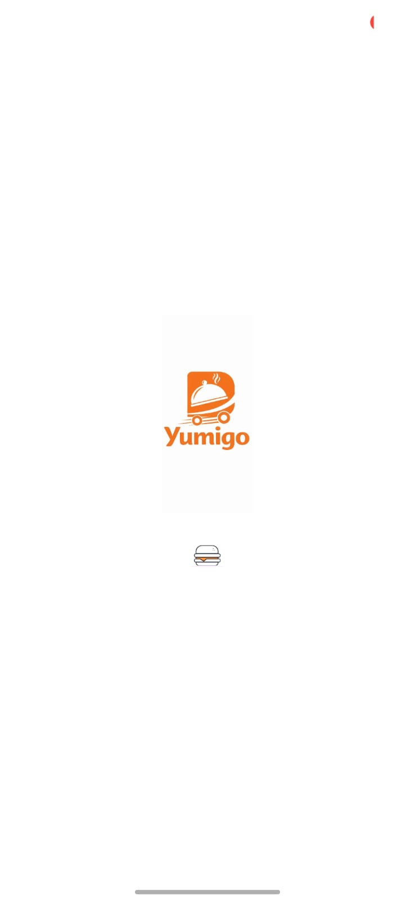
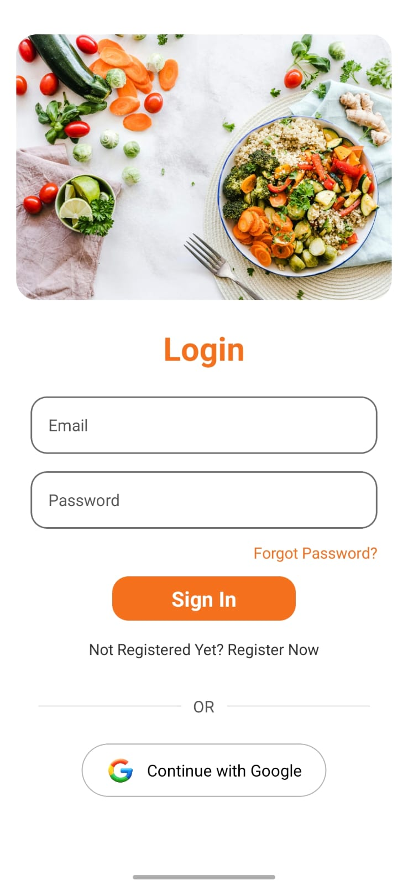
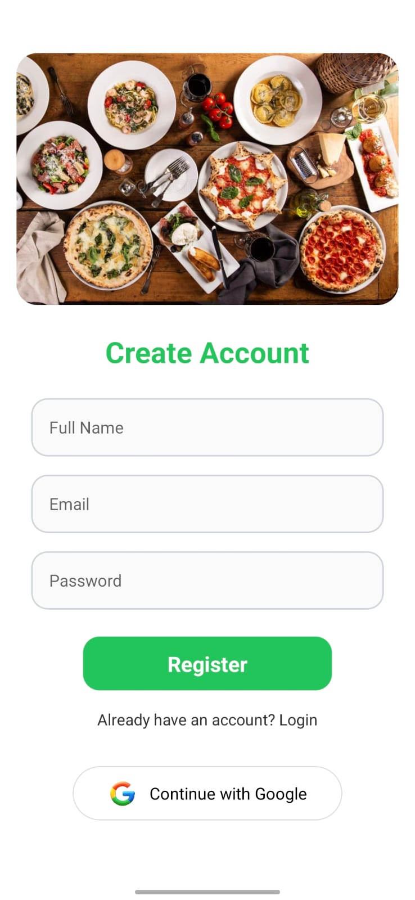
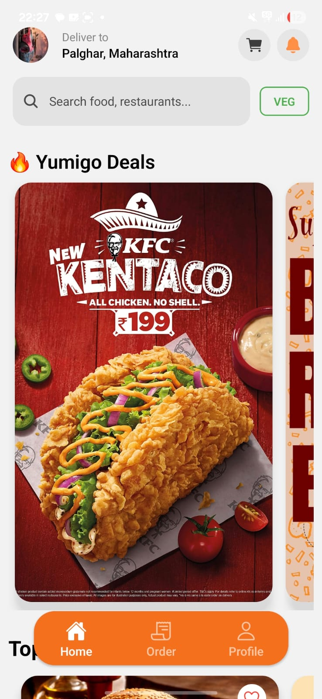
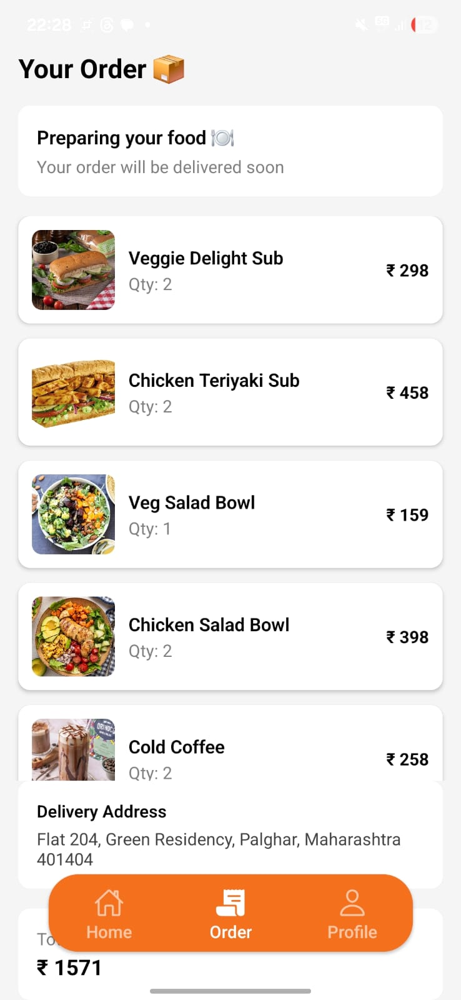
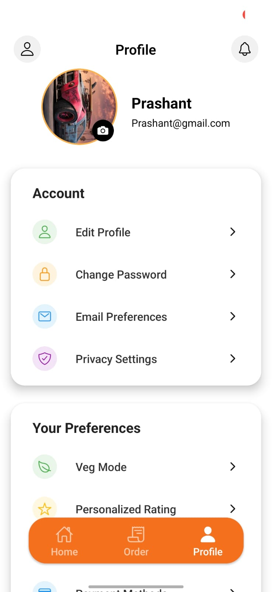

# 🍔 Yumigo Food Delivery App

Yumigo is a **full-stack food delivery mobile application** that allows users to explore restaurants, browse menus, add food to cart, and place orders through a smooth mobile interface.

The project is built using **React Native (Expo) for the frontend** and **Node.js, Express, and MongoDB for the backend API**.

---
## 📱 App Screens

<p align="center">
   
  
  
</p>

<p align="center">
   
  
  
</p>


# 🚀 Features

• User Registration & Login (JWT Authentication)
• Browse Restaurants and Food Categories
• Recommended & Top Picks Sections
• View Restaurant Menus
• Add Items to Cart
• Place Orders
• User Profile Screen
• REST API Backend
• MongoDB Database Integration

---

# 🛠 Tech Stack

### 📱 Frontend

* React Native
* Expo Router
* Axios
* AsyncStorage
* Responsive Screen (wp/hp)

### ⚙ Backend

* Node.js
* Express.js
* MongoDB Atlas
* Mongoose
* JWT Authentication
* REST API

---

# 📂 Project Structure

```
Yumigo_FoodDelivery_App
│
├── Backend
│   ├── Controller
│   │   ├── authController.js
│   │   ├── bannercontroller.js
│   │   ├── Cartcontroller.js
│   │   ├── categorycontroller.js
│   │   ├── menuController.js
│   │   ├── ordercontroller.js
│   │   └── restaurantController.js
│   │
│   ├── Models
│   │   ├── Banner.js
│   │   ├── Cart.js
│   │   ├── Category.js
│   │   ├── Menu.js
│   │   ├── Order.js
│   │   ├── Restaurant.js
│   │   └── User.js
│   │
│   ├── Router
│   │   ├── authRoutes.js
│   │   ├── bannerRouter.js
│   │   ├── cartRoutes.js
│   │   ├── categoryRoutes.js
│   │   ├── menuRoutes.js
│   │   ├── orderRoutes.js
│   │   └── restaurantRoutes.js
│   │
│   ├── Middleware
│   │   └── authMiddleware.js
│   │
│   ├── Database
│   │   └── db.js
│   │
│   └── server.js
│
├── Yumigo (Frontend)
│   ├── app
│   │   ├── Api
│   │   │   └── Api.jsx
│   │   │
│   │   ├── Authentication
│   │   │   ├── Login.jsx
│   │   │   └── Register.jsx
│   │   │
│   │   ├── Homecomponents
│   │   │   ├── Banner.jsx
│   │   │   ├── Recommended.jsx
│   │   │   └── Toppicks.jsx
│   │   │
│   │   ├── Restaurantcomponents
│   │   │   ├── Menuitem.jsx
│   │   │   └── Placeorder.jsx
│   │   │
│   │   ├── Screens
│   │   │   ├── Home.jsx
│   │   │   ├── Order.jsx
│   │   │   └── Profile.jsx
│   │   │
│   │   ├── Splashscreen.jsx
│   │   └── index.jsx
│   │
│   └── assets
│
└── README.md
```

---

# ⚙️ Installation Guide

## 1️⃣ Clone Repository

```
git clone https://github.com/Prashanty10/Yumigo_FoodDelivey_App.git
cd Yumigo_FoodDelivey_App
```

---

# ⚙ Backend Setup

```
cd Backend
npm install
```

Create `.env` file inside **Backend**

```
PORT=5000
MONGO_URL=your_mongodb_connection
JWT_SECRET=your_secret
```

Run backend:

```
npm start
```

---

# 📱 Frontend Setup

```
cd Yumigo
npm install
```

Run the mobile app:

```
npx expo start
```

---

**Prashant Yadav**

GitHub
https://github.com/Prashanty10

LinkedIn
https://www.linkedin.com/in/prashant-yadav-55258837b/

---


